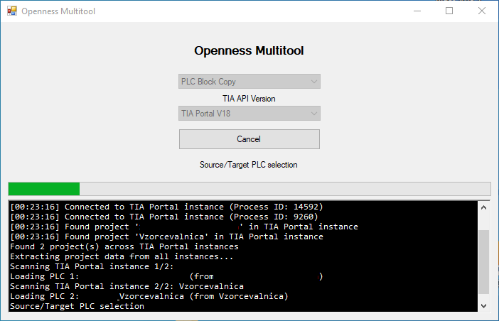
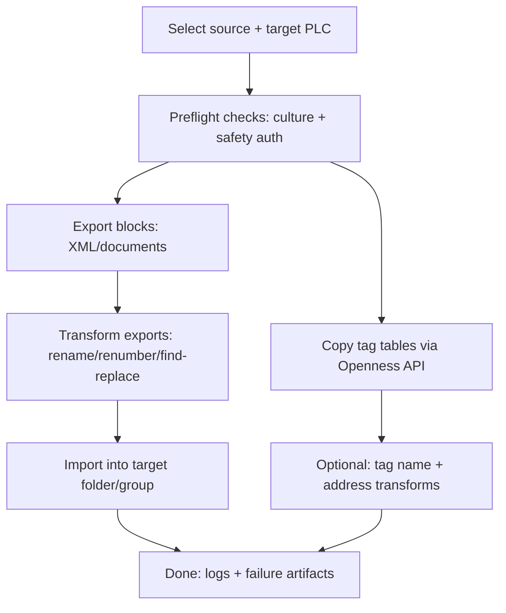
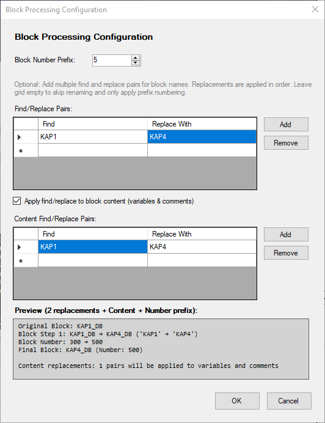
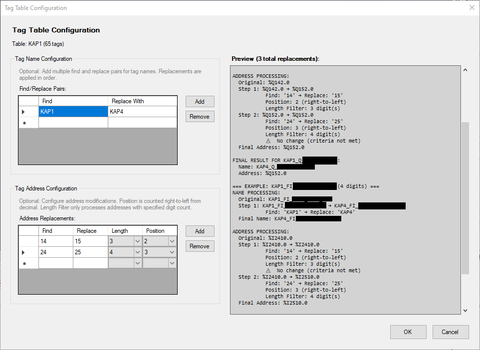
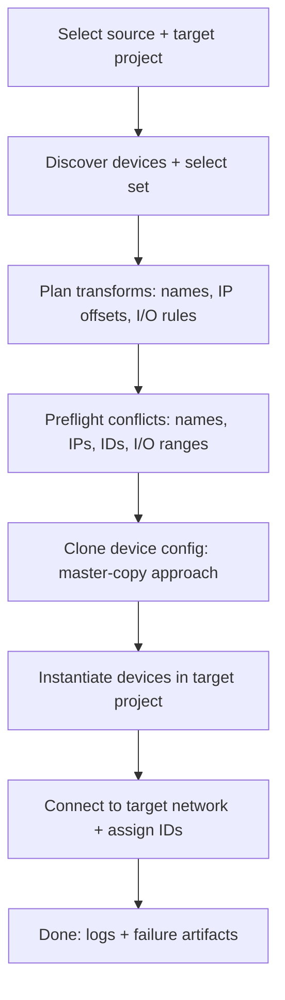
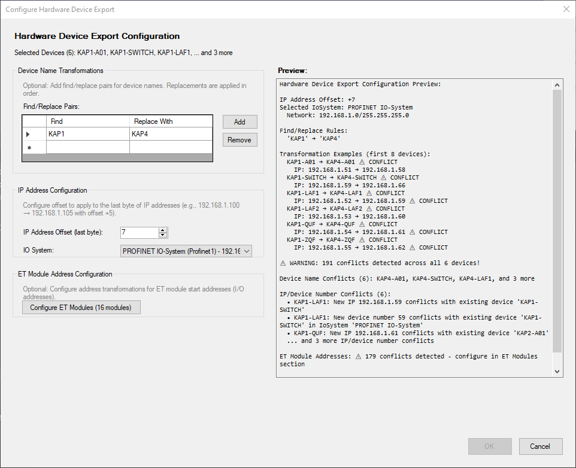
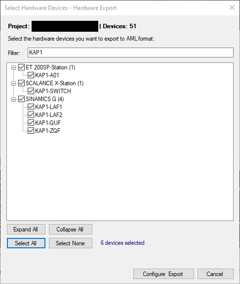
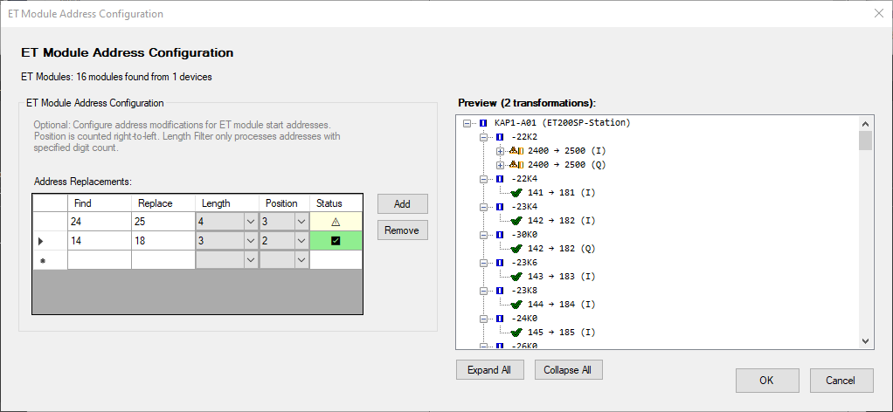
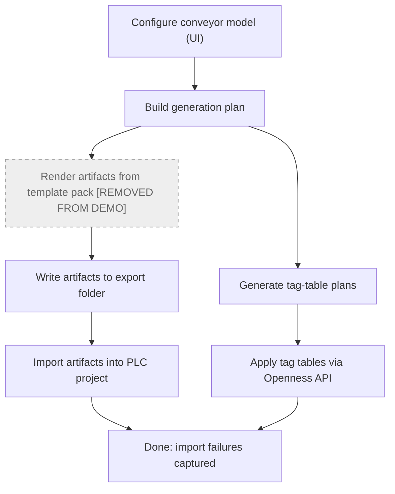
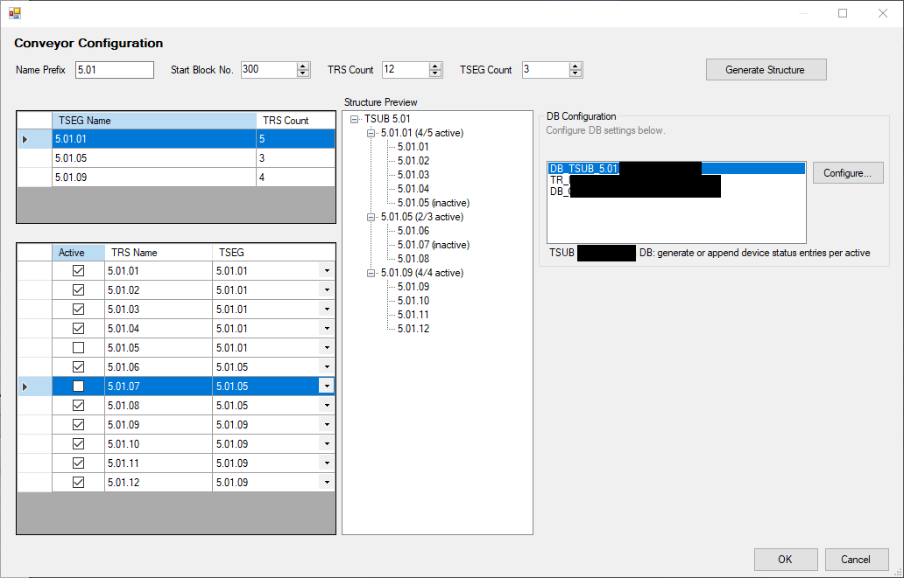

# OpennessCopy (TIA Portal Openness Multitool)

WinForms desktop app that automates repetitive engineering tasks inside Siemens TIA Portal by driving its automation SDK (the "Openness" API).

This repo exists as a portfolio/demo project. If you have zero PLC/TIA knowledge, you can treat it as:

"A Windows GUI tool that attaches to a running proprietary IDE, reads project state through an SDK, performs safe bulk transformations, and writes changes back with previews + collision checks."

## Project context

- Built as an internal productivity tool (this repo is a portfolio snapshot, not a product release)
- Originated from repeatedly doing these workflows manually; built to reduce time spent and prevent copy/paste mistakes
- Developed solo end-to-end (workflow design, WinForms UI, Openness SDK integration, transformations, validation, logging)
- Built over ~4-6 weeks of workdays and iterated based on frequent real-world use
- Evolved in phases: single-threaded block-copy utility -> WinForms workflow app -> STA/multi-threading + later additions (hardware copy, conveyor generator)

## What's intentionally missing from this public snapshot

- Siemens Openness SDK DLLs (`Siemens.Engineering*.dll`) are not included because I cannot legally redistribute them; they ship with a licensed TIA Portal installation
- Conveyor generator template payloads were removed/disabled to avoid publishing internal workplace control logic
- Automatic password-candidate generation was removed to avoid publishing internal conventions

## Domain primer (plain English)

- TIA Portal: Siemens' IDE used to configure industrial hardware and program industrial controllers.
- PLC project: roughly comparable to a software solution + device configuration bundled together.
- PLC blocks: reusable code/modules (think functions/classes + their compiled metadata).
- Tag tables: named variables that map to controller memory/addresses (a symbol table with extra constraints).
- Openness API: TIA Portal's official automation API for programmatic read/write access.

## What the tool does

The UI exposes three workflows.

> Screenshots are redacted to remove internal project names/paths, partner/customer references, equipment identifiers, and network details.

Main window (workflow selection + live log)

More screenshots are shown inside each workflow section below.

### 1) PLC block copy (export -> transform -> import)

Copies code blocks between projects/instances and optionally applies transformations:

- Renumber blocks using a prefix scheme (to avoid ID collisions in the target project)
- Find/replace block names and (optionally) internal content identifiers
- Copy tag tables and apply name + address transformations (with example previews)
- Handles safety-protected projects by prompting for authorization when required
- Creates a new folder/group in the target project and imports there (minimizes destructive edits)

Block processing configuration + preview

Tag table configuration (name + address transforms)

### 2) Hardware copy (device tree + networking + address safety)

Copies configured hardware devices between projects with collision-aware automation:

- Uses a "Global Library / Master Copy" approach (often preserves device settings better than export/import round-trips)
- Allows find/replace transformations on device and module names
- Assigns network settings (IP, subnet, device IDs) and connects devices to an existing target network
- Detects conflicts up front (device names, IPs, device numbers, IO address ranges) and blocks applying invalid plans
- Includes targeted support for modular IO module address transformations

Configuration preview + conflict detection (validation gate)

  
More hardware screenshots

  Device selection

  

  ET module address configuration

  

### 3) Conveyor generator (TIA V20)

Conveyor generator existed in the internal build, but was removed/disabled in this public portfolio snapshot.

Why it was removed:

- The generator relied on embedded PLC templates and naming conventions that are specific to my workplace.
- I don't want to publish any internal control logic or template payloads in a public repo.

What it did in the internal build (high level):

- Generate a consistent project structure for a conveyor system (folders/groups + naming)
- Generate/import code modules and structured data definitions from templates
- Support "generate or append" updates to large structured data (iterate without recreating everything)
- Generate variable tables (symbol/variable definitions) using repeatable address allocation rules
- Preserve failed import artifacts for debugging (`%LOCALAPPDATA%\OpennessCopy\ImportFailures`)

What remains in this snapshot:

- The surrounding workflow/UI and parts of the import pipeline are still present to demonstrate the overall architecture.
- The app still builds, but the Conveyor Generator workflow is intentionally incomplete/broken and should be treated as a non-functional demo entry.

Configuration UI (generation payload removed in public snapshot)

## Why this is interesting (software-engineering-wise)

Even if you don't work with PLCs, the engineering problems are familiar:

- SDK integration under strict threading rules (Openness objects must be accessed from an STA thread)
- "Export -> transform -> import" pipelines with deterministic rewrites and guardrails
- Non-trivial conflict detection against existing target state before mutating it
- UI-driven, step-by-step workflow design (wizards, previews, validation gates)
- Versioned dependency loading (TIA V18 vs V20) without shipping proprietary DLLs
- Practical diagnostics (UI logger + optional file logging + retained failure artifacts)

## Why WinForms / .NET Framework 4.8

TIA Portal Openness targets the .NET Framework ecosystem, so this tool is built as a WinForms app on .NET Framework 4.8 to integrate cleanly with the Siemens PublicAPI assemblies.

## Key constraint: STA threading

The Openness API requires Single-Threaded Apartment (STA) access for many engineering objects, so each workflow runs its core SDK calls on a dedicated STA thread and marshals work to it.

## Tech

- C# / WinForms (.NET Framework 4.8)
- Siemens TIA Portal Openness PublicAPI (not included in this repo; ships with TIA Portal)
- XML processing + transformation utilities

## Build / Run (only possible with TIA Portal installed)

Requirements:

- Windows
- Visual Studio (to build) + .NET Framework 4.8 targeting pack
- Siemens TIA Portal installed with Openness enabled

Notes on dependencies:

- The Siemens `Siemens.Engineering*.dll` PublicAPI assemblies are not distributed here (they ship with TIA Portal; redistribution is not permitted).
- The app loads them from the expected install locations for V18/V20.
- If your TIA Portal path differs, adjust `Services/DependencyManagementService.cs`.

If you don't have TIA Portal installed:

- You likely won't be able to build/run this project locally (missing proprietary SDK assemblies).
- You can still review the implementation via the "Code tour" section.

Build:

1) Open `OpennessCopy.sln`
2) Build the solution
3) Run the executable; add `-debug` to write a `debug.txt` next to the executable

## Code tour (good entry points)

Start here (workflow UX + orchestration):

- App entry + main form: `Program.cs`, `Forms/MainForm.cs`
- Block copy wizard flow: `Forms/MainForm.BlockWorkflow.cs`
- Hardware copy wizard flow: `Forms/MainForm.HardwareWorkflow.cs`
- Conveyor generator UI + workflow shell (generation removed here): `Forms/MainForm.ConveyorWorkflow.cs`
- STA marshalling for SDK constraints: `Services/StaTaskQueue.cs`
- Export/transform/import pipeline (deterministic rewrites): `Services/BlockCopy/BlockXmlProcessingService.cs`
- Import + failure preservation (used by generator pipeline): `Services/CodeBuilders/GeneratedArtifactImportService.cs`
- Versioned dependency discovery/loading (V18 vs V20): `Services/DependencyManagementService.cs`
- Small, readable utilities: `Services/CodeBuilders/TagTables/LogicalAddressGenerator.cs`, `Utils/TagAddressAnalyzer.cs`

## Notes / limitations

- This is a portfolio snapshot of an internal tool, not a polished product.
- Conveyor generator template payloads were removed for confidentiality; the workflow is intentionally incomplete in this snapshot.
- There is no automated test suite; validation is primarily manual through the UI workflows.
- Siemens, TIA Portal, and Openness are trademarks/technologies owned by Siemens. This repo is not affiliated with Siemens.

## License / usage

This repository is provided for portfolio review only.

No license is granted for use, copying, modification, redistribution, or derivative works unless you have my explicit written permission.
